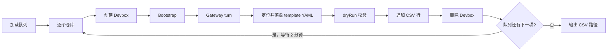

# brain-skills-benchmark

> 在 Sealos Devbox 上对一批可部署的 GitHub 仓库依次执行 sandbox skill（Codex Gateway turn），并将每个仓库的结果与 API 用量写入 CSV。

对代表性开源仓库做**批量 benchmark**：自动创建 Devbox、运行技能、汇总用量、清理资源，适合评估 sandbox skill 在真实项目上的部署表现与成本。

## 前置条件

- **Node.js** 18+（ESM，`"type": "module"`）
- 可访问的 **Sealos Devbox** 控制面（`SEALOS_HOST` 或 `DEVBOX_BASE_URL`）
- **Devbox API 凭证**：`DEVBOX_JWT_SIGNING_KEY` 或 `DEVBOX_TOKEN`（二选一）
- **GitHub token**：注入 Devbox，供 skill 推镜像等
- **Codex Gateway API key**：Devbox 内 agent 调用（与 Brain UI 同名变量）
- **技能仓库 URL**：`BRAIN_SANDBOX_SKILLS_GIT`，供 Devbox 内 `npx skills add` 安装
- **Sealos Template API URL**：`SEALOS_TEMPLATE_API_URL`，benchmark 队列来源（需可访问外网）

## 快速开始

```bash
npm install
cp .env.example .env
# 编辑 .env，填入 Sealos / Devbox、GitHub、Gateway、技能仓库等必填项
npm run benchmark
```

主入口为 **`npm run benchmark`**（`node run.mjs` → `src/run.mjs`）。

只想先试几个仓库时：

```bash
BENCHMARK_LIMIT=3 npm run benchmark
```

> [!WARNING]
> 每个仓库的 Gateway turn 默认最长 **30 分钟**（`BENCHMARK_TURN_TIMEOUT_MS`）。全量队列可能运行数小时；仓库之间默认 **间隔 2 分钟**。

## 流程概览



1. 从 `SEALOS_TEMPLATE_API_URL` 拉取 Sealos App Store 已上架 template，过滤出 GitHub 仓库作为队列；未设置 `BENCHMARK_LIMIT` 时处理全部条目，设置后只取前 N 个。
2. 对每个仓库：创建 Devbox → bootstrap → Gateway turn → **在 Devbox 删除前定位并落盘 skill 产出的 template YAML** → **对 YAML 调用 Sealos Template API（`dryRun: true`）校验是否可被消费** → **按本仓时间窗拉取 API 用量并追加 CSV 一行** → 删除 Devbox。
3. 若队列里还有下一项，**等待 2 分钟** 再开始下一个仓库。

单仓失败不会中断整次运行：会写入 `status=failed` 的一行，清理 Devbox 后继续下一项。每仓完成后立即追加 CSV，中途 Ctrl+C 时已完成行仍会保留。

Devbox / Gateway 客户端实现见 `src/lib/devbox/` 与 `src/lib/overview-usage.mjs`。

## 环境变量

复制 [`.env.example`](.env.example) 后至少配置：

| 变量 | 说明 |
|------|------|
| `SEALOS_TEMPLATE_API_URL` | Sealos Template 列表 API（benchmark 队列） |
| `SEALOS_TEMPLATE_API_URL_DEPLOY` | Template 部署 API 完整 POST URL（`dryRun: true` 校验） |
| `SEALOS_KUBECONFIG` | URL-encoded kubeconfig（`Authorization` 头，供 dryRun） |
| `SEALOS_HOST` | Sealos 集群主机名 |
| `DEVBOX_TLS_INSECURE` | 自签证书集群时设为 `1` |
| `DEVBOX_JWT_SIGNING_KEY` 或 `DEVBOX_TOKEN` | Devbox API 认证（二选一） |
| `GITHUB_TOKEN` | 注入 Devbox，供 skill 推镜像等 |
| `CODEX_GATEWAY_OPENAI_API_KEY` | Devbox 内 Codex Gateway |
| `BRAIN_SANDBOX_SKILLS_GIT` | `npx skills add` 的技能仓库 URL |
| `BENCHMARK_LIMIT` | 可选；本次运行处理的仓库数量（省略则处理全部 template 队列） |

常用可选项：`BENCHMARK_TURN_TIMEOUT_MS`（turn 超时，默认 30 分钟）、`BENCHMARK_TURN_POLL_MS`、`BENCHMARK_DEVBOX_BOOTSTRAP_TIMEOUT_MS`、`BENCHMARK_DEVBOX_MAX_DURATION_MINUTES` 等，见 `.env.example`。

> [!NOTE]
> 自签证书集群务必设置 `DEVBOX_TLS_INSECURE=1`，否则 Node `fetch` 会因 TLS 校验失败。

## 结果

一次 benchmark 运行结束后，终端会打印 CSV 路径。文件写在仓库根目录 **`.report/`** 下，例如：

```text
.report/benchmark-2026-06-04_11-02-33.csv
```

| 列 | 含义 |
|----|------|
| `full_name` | `owner/repo` |
| `category` | 保留列；Sealos template 队列无此元数据时为空 |
| `deploy_difficulty` | 保留列；Sealos template 队列无此元数据时为空 |
| `status` | `success` 或 `failed` |
| `error` | 失败时的错误信息 |
| `started_at` / `finished_at` | 本仓处理起止时间（本地时区） |
| `runtime_name` | Devbox runtime 名称 |
| `gateway_session_id` | Gateway 会话 ID |
| `duration` | 本仓耗时 |
| `api_requests` / `api_tokens` / `api_cost_usd` | 该仓 `started_at`～`finished_at` 内 overview API 汇总 |
| `template_yaml_path` | 落盘 YAML 本地路径（`.report/templates/...`） |
| `template_dryrun_status` | `success` / `failed` / `skipped`（无 YAML 或未配置 dryRun 时） |
| `template_dryrun_error` | dryRun 失败或跳过时原因 |

`status` 映射规则：Gateway turn 为 `completed`、`succeeded` 或 `interrupted` 时记为 `success`，其余为 `failed`。基础设施异常（创建 Devbox、bootstrap 等）也会记为 `failed`。

`.report/` 已在 `.gitignore` 中忽略。

## 调试命令

在启动完整 benchmark 前，建议由浅入深验证链路：

```bash
npm run devbox:health          # Devbox API 连通性
npm run devbox:health:auth     # 上述 + JWT 认证
SMOKE_REPO=ollama/ollama npm run devbox:smoke   # 单仓 create → bootstrap → delete（无 turn）
BENCHMARK_LIMIT=1 npm run benchmark             # 端到端单仓（含 turn，可能较久）
```

## 辅助脚本

| 脚本 | 用途 |
|------|------|
| `node scripts/fetch-overview-records.mjs` | 拉取 Gateway overview 用量记录（与 CSV 汇总同源） |
| `npm run template:dryrun -- <path>` | 对本地 YAML 单独跑 Sealos `dryRun: true` |
| `npm run devbox:locate-template-smoke` | 在已有 Devbox 上验证 template YAML 定位与落盘 |

## 项目结构

```text
run.mjs              # npm 入口
src/run.mjs          # 总控循环（队列、间隔、错误恢复）
src/context.mjs      # 单次运行的共享状态
src/steps/step-*     # 各步骤（队列、Devbox、skill、CSV、清理）
src/lib/             # Devbox API、Gateway 客户端、env、CSV 等
src/steps/step-1-load-queue/  # 从 Sealos Template API 加载 benchmark 队列
scripts/             # 健康检查、冒烟、用量查询
2000-repos/          # 历史仓库分析 JSON（非 benchmark 队列）
```
