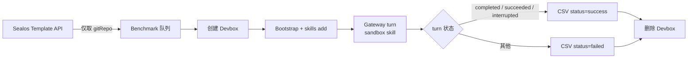
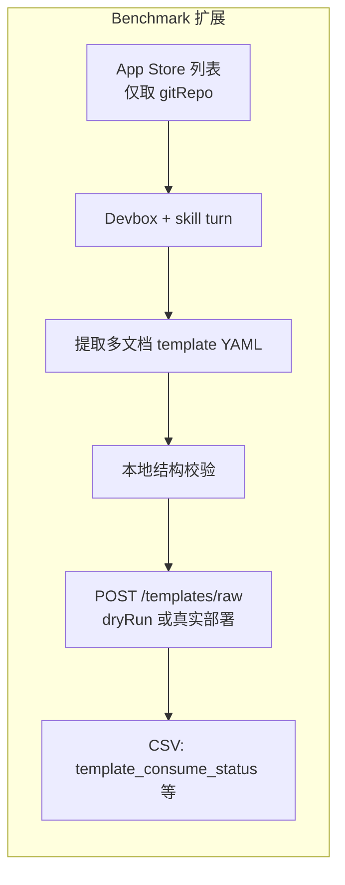

# P0：确保 skill 生成的 templates 可被 Sealos consume

> 分支：`p0/sealos-template-consume`  
> 来源：[ROADMAP.md](./ROADMAP.md) — P0 Sealos 集成  
> 状态：**讨论中**（本文件用于对齐目标、范围与验收标准）

---

## 1. 问题陈述

brain-skills-benchmark 当前能在 Sealos Devbox 上批量跑 sandbox skill，并以 **Gateway turn 是否完成** 作为 `status=success` 的主要判据。但这与 ROADMAP 中的 P0 目标仍有差距：

> skill 的价值最终要体现在 **Sealos 能消费并部署** 生成的 template，而不仅是「文件生成成功」或「镜像 push 成功」。

换句话说，benchmark 的「成功」需要向 **Sealos Template 消费端** 对齐，否则我们可能在优化一个与真实用户路径脱节的指标。

---

## 2. 当前链路（as-is）



**已有能力：**

| 环节 | 实现位置 | 说明 |
|------|----------|------|
| 测试集来源 | `src/steps/step-1-load-queue/load-templates-from-sealos.mjs` | 从 `SEALOS_TEMPLATE_API_URL` 拉 template 列表，过滤 GitHub `gitRepo` → `{ full_name }` |
| Skill 执行 | `src/lib/devbox/gateway/turn.mjs` + `prompt.mjs` | Devbox 内跑 sandbox skill（`BRAIN_SANDBOX_SKILLS_GIT`） |
| 成功判定 | `src/lib/devbox/gateway/completion.mjs` | Gateway turn 终态映射为 benchmark `status` |
| 结果输出 | `.report/benchmark-*.csv` | 耗时、token、成本等 |

**缺失环节（P0 要补的）：**

1. **Template 产物校验** — skill 产出的多文档 YAML 是否符合 Sealos **部署 template** 规范（见 §3）
2. **消费端联调** — 产物能否通过 Template API v2alpha 的 `POST /templates/raw` 被集群接受（可先 `dryRun: true`）
3. **Benchmark 闭环** — 将「可部署」纳入成功标准（或至少作为独立列记录）

---

## 3. 两套 API，不要混用

### 3.1 App Store 列表 API（benchmark 队列来源，≠ 部署格式）

`SEALOS_TEMPLATE_API_URL`（如 `.../api/listTemplate?language=en`）返回的是 **App Store 上架应用的目录元数据**，用于 benchmark 选取 `gitRepo` 作为测试仓库。字段包括 `title`、`description`、`screenshots`、`deployCount`、`filePath` 等，**与 Sealos 实际部署消费的 template YAML 无关**。

本仓库 `load-templates-from-sealos.mjs` 只从中提取 `spec.gitRepo` → `full_name`，用法正确；但 **不能** 把该响应当作 skill 应产出的格式参考。

### 3.2 Template API v2alpha（部署 / 导入消费端）

Sealos template **导入与部署** 有独立 API，文档与 OpenAPI：

- 交互文档：<https://template.hzh.sealos.run/api/v2alpha/docs>
- OpenAPI：`{baseUrl}/api/v2alpha/openapi.json`

| 方法 | 路径 | 用途 |
|------|------|------|
| `GET` | `/templates` | 列出 catalog 元数据（无资源计算） |
| `GET` | `/templates/{name}` | 单 template 详情 + `quota` |
| `POST` | `/templates/raw` | **用原始 YAML 部署自定义 template**（P0 核心） |
| `POST` | `/templates/instances` | 按 catalog 名称创建实例 |
| `DELETE` | `/templates/instances/{instanceName}` | 删除实例 |

变更类接口需在 `Authorization` 头传入 **URL-encoded kubeconfig**（`encodeURIComponent(kubeconfigYaml)`）。

**P0 联调（已决）：** 对落盘 YAML 发 **`POST`**，目标 URL 由环境变量 **`SEALOS_TEMPLATE_API_URL_DEPLOY`** 提供（**完整 endpoint**，无需再拼接 path）：

```bash
SEALOS_TEMPLATE_API_URL_DEPLOY=https://template.hzh.sealos.run/api/v2alpha/templates/raw
```

请求体（benchmark 固定 `dryRun: true`）：

```json
{
  "yaml": "<落盘的 index.yaml 内容>",
  "dryRun": true
}
```

- `dryRun: true` → `200`，经 K8s API 校验但不创建资源（**P0 验收标准**）
- `dryRun: false` → `201`，实际部署 instance（本阶段不做）
- `Authorization` 头：URL-encoded kubeconfig（`SEALOS_KUBECONFIG`，待接入）

### 3.3 Sealos 期待的部署 template 格式（来自 v2alpha OpenAPI）

skill 应产出的是 **多文档 YAML 字符串**，结构为：

1. **第一段**：`apiVersion: app.sealos.io/v1` / `kind: Template`，含 `metadata.name` 与 `spec.defaults`（及可选 `spec.inputs`）
2. **后续段**：以 `---` 分隔的一个或多个 **Kubernetes 资源**（Deployment、Service、Ingress 等），字段内使用模板变量如 `${{ defaults.app_name }}`

OpenAPI 中的最小示例：

```yaml
apiVersion: app.sealos.io/v1
kind: Template
metadata:
  name: my-app
spec:
  defaults:
    app_name:
      type: string
      value: my-app-${{ random(8) }}
---
apiVersion: apps/v1
kind: Deployment
metadata:
  name: ${{ defaults.app_name }}
spec:
  replicas: 1
  selector:
    matchLabels:
      app: ${{ defaults.app_name }}
  template:
    metadata:
      labels:
        app: ${{ defaults.app_name }}
    spec:
      containers:
        - name: app
          image: nginx:latest
          resources:
            limits:
              cpu: 100m
              memory: 256Mi
```

**与 App Store 列表的区别：**

| | App Store `listTemplate` | 部署 template YAML |
|--|--------------------------|-------------------|
| 用途 | 商店展示、选 repo | 集群 import / deploy |
| 含 K8s 资源 | 否 | 是（`---` 后多文档） |
| `title` / `icon` / `screenshots` | 有 | 无（非部署必需） |
| 消费 API | 无（只读列表） | `POST /templates/raw` |

**待确认（讨论项）：**

- skill 产出的文件是完整多文档 YAML，还是分散文件需 benchmark 拼接？
- `spec.inputs` 与 `args` 的必填规则：OpenAPI 称「仅无 default 的 args 必填」
- ~~benchmark 验收用 `dryRun` 即可？~~ **已决：仅用 `dryRun: true`**

---

## 4. 差距分析

| 维度 | 当前 benchmark | P0 目标 |
|------|----------------|---------|
| 成功定义 | Gateway turn 终态 | Sealos 能 import + deploy |
| Template 校验 | 无 | 格式、必填字段、语法 |
| 测试集方向 | 从 Sealos 拉 repo 列表 → 反向生成 | 生成物应能回到 Sealos |
| 失败归因 | bootstrap / turn 超时 / skill 报错 | 需区分：构建失败 vs template 不合规 vs 部署失败 |
| 技能仓库 | `BRAIN_SANDBOX_SKILLS_GIT`（外部） | 可能需改 skill prompt/步骤，也可能需改 benchmark 验证层 |

**历史数据参考**（2026-06-05 批次，20 仓，95% turn 成功率）说明 Devbox 链路已相对稳定，但 **未验证** 这些「成功」仓库的 skill 产物能否在 Sealos 上实际部署。

---

## 5. 建议工作流（to-be）



### 5.1 子任务拆分（草案）

- [ ] **A. 摸清 skill 产物** — 在 Devbox turn 结束后，template 文件落在哪、命名约定、是否 push 到某 git/registry
- [ ] **B. 对齐 v2alpha consume 契约** — 以 `openapi.json` + `POST /templates/raw` 为准；明确 `dryRun` vs 真实 deploy 的验收边界
- [ ] **C. 实现校验层** — 可在 benchmark 仓库新增 step（如 `step-2-4-validate-template`）或独立脚本
- [ ] **D. 联调用例集** — 简单 / 中等 / 复杂各若干（可与历史 benchmark 长尾样本对齐）
- [ ] **E. 扩展 CSV / 报告** — 新增列，例如 `template_valid`、`sealos_deploy_status`、`deploy_error`
- [ ] **F. 反馈 skill** — 将校验/部署失败模式回流 `BRAIN_SANDBOX_SKILLS_GIT`（可能跨仓库）

### 5.2 用例分层（草案）

| 层级 | 特征 | 候选 repo（来自历史 benchmark） |
|------|------|--------------------------------|
| 简单 | 根目录 Dockerfile 或单服务 compose | `louislam/uptime-kuma`、单容器静态站 |
| 中等 | 多 Dockerfile/compose、需选入口 | `Stirling-Tools/Stirling-PDF`、`nocodb/nocodb` |
| 复杂 | monorepo、DB/Redis/GPU 依赖 | `immich-app/immich`、`Pythagora-io/gpt-pilot` |

每层至少 1 个 **正向**（应 deploy 成功）+ 关注 **失败模式** 是否可复现。

---

## 6. 开放问题（需在本会话对齐）

1. **验收标准**  
   - **已决**：`POST SEALOS_TEMPLATE_API_URL_DEPLOY` + `dryRun: true` 返回成功即视为「可被 consume」  
   - 待决：是否区分 dev 集群 vs 生产 App Store 环境

2. **产物获取方式**  
   - **已做**：删除 Devbox 前落盘 `.report/templates/<runId>/<owner>-<repo>/index.yaml`  
   - **已做**：读取落盘 YAML，POST 至 `SEALOS_TEMPLATE_API_URL_DEPLOY`（`dryRun: true`）；结果写入 CSV `template_*` 列

3. **改动边界**  
   - 本仓库（benchmark 编排 + dryRun 校验）vs 技能仓库各自改什么  
   - **已决 env**：`SEALOS_TEMPLATE_API_URL_DEPLOY`（完整 POST URL）  
   - **已接入**：`SEALOS_KUBECONFIG`（Authorization 头）

4. **与现有 `status` 的关系**  
   - 保持 turn 成功为主、`sealos_deploy_status` 为辅？  
   - 还是将 P0 完成后 **重新定义** `status=success`？

5. **成本与时长**  
   - 全量队列若每仓增加 deploy 探测，墙钟时间可能显著上升；是否仅对 `BENCHMARK_LIMIT` 子集或 nightly 全量？

6. **Template schema 来源**  
   - 已确认：v2alpha OpenAPI（`.../api/v2alpha/openapi.json`）  
   - 待决：是否从 `labring-actions/templates` 等仓库取 golden `index.yaml` 作对照（非 App Store JSON）

---

## 7. 建议的近期里程碑

| 阶段 | 目标 | 产出 |
|------|------|------|
| **M0 对齐** | 回答 §6 开放问题，锁定验收标准 | 更新本 `task.md` 的「已决」章节 |
| **M1 摸底** | 跑 1～3 个仓，手工检查 skill 产物 + Sealos 导入路径 | 产物路径文档、样例 YAML |
| **M2 最小校验** | 自动化 schema/字段检查，写入 CSV | 新 step 或 script + 单测 |
| **M3 部署联调** | 简单用例端到端 deploy 成功 | 3 层用例各 ≥1 通过 |
| **M4 闭环** | benchmark 默认带 consume 检查；ROADMAP P0 勾选 | PR + 文档更新 |

---

## 8. 相关代码与配置

| 路径 | 用途 |
|------|------|
| `ROADMAP.md` | P0 任务来源 |
| `src/steps/step-1-load-queue/` | 从 Sealos 拉测试队列 |
| `src/lib/devbox/gateway/prompt.mjs` | 发给 agent 的 benchmark prompt |
| `src/lib/devbox/gateway/completion.mjs` | turn → `status` 映射 |
| `src/lib/devbox/gateway/transcript-log.mjs` | Gateway transcript（失败分析用） |
| `.env.example` | `SEALOS_TEMPLATE_API_URL`（队列）、`SEALOS_TEMPLATE_API_URL_DEPLOY`（dryRun POST）、`BRAIN_SANDBOX_SKILLS_GIT` 等 |
| Template API v2alpha 文档 | <https://template.hzh.sealos.run/api/v2alpha/docs> |
| `BRAIN_SANDBOX_SKILLS_GIT` | 外部技能仓库（默认 `sealos-skills` / `sandbox-skill-lite`） |

---

## 9. 已决 / 待决记录

> 讨论后把结论写在这里，避免重复对齐。

### 已决

- **App Store 列表 ≠ 部署格式**：`SEALOS_TEMPLATE_API_URL` 返回的是商店目录元数据，仅用于 benchmark 选 repo；不能作为 skill 产物格式参考。
- **部署消费端 API**：`SEALOS_TEMPLATE_API_URL_DEPLOY` = 完整 POST URL（如 `https://template.hzh.sealos.run/api/v2alpha/templates/raw`），不再拼接 path。
- **验收方式（已决）**：落盘 YAML + `dryRun: true`；`200` 即通过，不真部署。
- **部署 template 结构**：`kind: Template` 头文档 + `---` 分隔的 K8s 资源；变量语法 `${{ defaults.* }}` / `${{ random(N) }}`（见 OpenAPI 示例）。
- **skill 产物路径（已实测）**：Devbox 内 `/home/devbox/workspace/.sealos/template/index.yaml`；benchmark 落盘至 `.report/templates/<runId>/<owner>-<repo>/index.yaml`。

### 待决

- `status` 是否纳入 `template_dryrun_status`；见 §6 其余项

### CSV 列（P0）

- `template_yaml_path`：落盘路径  
- `template_dryrun_status`：`success` / `failed` / `skipped`  
- `template_dryrun_error`：失败或跳过原因

---

## 10. 会议笔记

> 在本会话中追加讨论要点、决策与 action items。

### 2026-06-08

- 创建分支 `p0/sealos-template-consume` 与本 `task.md`
- **纠正**：§3 原先误将 App Store `listTemplate` 响应当作 Sealos 部署格式；已改为区分「队列 API」与「v2alpha 部署 API」
- **补充**：部署消费端为 `POST /templates/raw`；OpenAPI 已拉取并写入 §3
- skill 产物路径已确认；落盘 step 已实现
- **2026-06-09**：验收定为 **`dryRun: true`**；部署 API 环境变量为 **`SEALOS_TEMPLATE_API_URL_DEPLOY`**（完整 URL，不拼接 path）
- **dryRun 客户端已实现**：`src/lib/sealos/template-dryrun.mjs` + `step-2-6-dryrun-template`；测试脚本 `npm run template:dryrun -- <path>`
- **自建集群 TLS**：`DEVBOX_TLS_INSECURE=1` 时，dryRun 会在提交的 kubeconfig 中注入 `insecure-skip-tls-verify: true`（见 `src/lib/sealos/kubeconfig-auth.mjs`）
- **dryRun 联调成功**：`SEALOS_TEMPLATE_API_URL_DEPLOY=https://template.usw-1.sealos.io/api/v2alpha/templates/raw` + usw-1 用户 kubeconfig；`Reactive-Resume` 落盘 YAML → **HTTP 200**，`dryRun: true`，预览 Deployment/Service/Ingress 等
- **CSV 扩展**：`template_yaml_path` / `template_dryrun_status` / `template_dryrun_error`；写 CSV 前完成 locate + dryRun（`src/run.mjs` finally 顺序）
